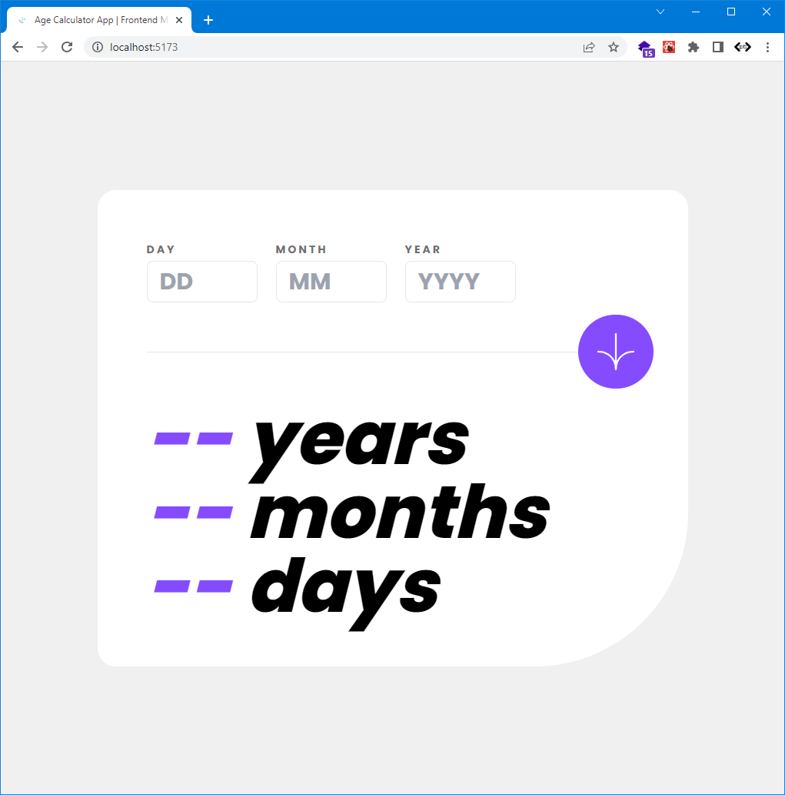

# Frontend Mentor - Age calculator app solution

This is a solution to the [Age calculator app challenge on Frontend Mentor](https://www.frontendmentor.io/challenges/age-calculator-app-dF9DFFpj-Q). Frontend Mentor challenges help you improve your coding skills by building realistic projects.

- [Acknowledgments](#acknowledgments) -->

## Overview

### The challenge

Users should be able to:

- View an age in years, months, and days after submitting a valid date through the form
- Receive validation errors if:
  - Any field is empty when the form is submitted
  - The day number is not between 1-31
  - The month number is not between 1-12
  - The year is in the future
  - The date is invalid e.g. 31/04/1991 (there are 30 days in April)
- View the optimal layout for the interface depending on their device's screen size
- See hover and focus states for all interactive elements on the page

### Screenshot

### Links

- Solution URL: [GitHub](https://github.com/leocsdev/reactv-fem-age-calculator-app)
- Live Site URL: [Vercel](https://leocsdev-age-calculator-app.vercel.app/)

### Built with

- Semantic HTML5 markup
- Mobile-first workflow
- [React](https://reactjs.org/) - JS library
- [Tailwind CSS](https://tailwindcss.com/) - For styles

### What I learned

I learned to use react hook form and moment.js

## Author

- Website - [Add your name here](https://leocsdev.com)
- Frontend Mentor - [@leocsdev](https://www.frontendmentor.io/profile/leocsdev)
- Twitter - [@leocsdev](https://www.twitter.com/leocsdev)
